

  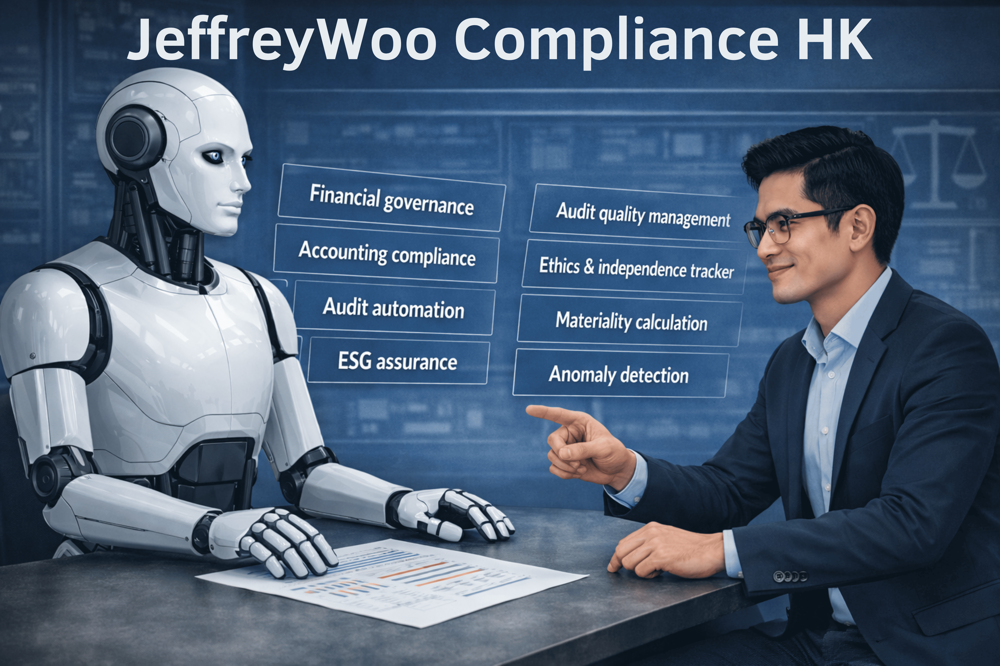

## 📊 Overview

> **Not your typical compliance checklist tool!**

**JeffreyWoo HK Compliance** is an AI-powered compliance monitoring framework that automatically detects anomalies and potential non-compliance with Hong Kong accounting and auditing frameworks. It helps audit firms, accounting managers, and compliance officers catch issues early, reduce risk, and prepare for regulatory inspections. It automates anomaly detection across HKFRS, HKAS, HKSA, HKSQM, HKSAE, HKSRS, HKICPA Code of Ethics, and Environmental, Social and Governance (ESG) sustainability disclosures.

## ✨ What It Does
- 📑 **Multi‑Framework Compliance** – Automatically checks financial statements, audit working papers, and Environmental, Social and Governance (ESG) disclosures against HKFRS, HKAS, HKSA, HKSQM, HKSAE, HKSRS, HKICPA Code of Ethics, and ESG guidance.
- ⚖️ **Materiality & Risk Triage** – Calculates overall materiality, performance materiality, and clearly trivial thresholds (HKSA 320). Flags issues by severity (Critical / High / Medium / Low) so you focus on what really matters.
- 🎯 **Audit Sampling Engine** – Uses materiality values to compute required sample sizes under HKSA 530. Alerts when sample sizes are insufficient.
- 🔍 **Ethics & Independence Tracker** – Detects breaches of confidentiality, objectivity, and independence (e.g., audit partner also providing tax advisory).
- 📦 **Regulatory Inspection View** – One‑click export of the entire audit file in HKICPA Practice Review‑ready format (PDF, Excel). Filter by standard (e.g., HKSA 230).
- 🌱 **ESG Assurance Readiness** – Reviews sustainability disclosures against emerging standards and HKICPA guidance. Flags unsupported claims (e.g., “carbon neutral” without evidence).
- 🏢 **Multi‑Company & IRD Support** – Handles multiple clients, each with its own data. Classifies year‑ends using Hong Kong Inland Revenue Department (IRD) Accounting Date Codes (N / D / M).

## 🗓️ IRD Accounting Date Codes
- **N code:** 1 April to 30 November → filing due within 1 month of issue, no extension allowed.
- **D code:** 1 December to 31 December → filing due within 1 month of issue, extension available until August 15.
- **M code profit cases:** 1 January to 31 March → filing due within 1 month of issue, extension available until November 15
- **M code loss cases:** 1 January to 31 March → filing due within 1 month of issue, extension available until January 31 of the following year 

**Note:** Audit firms often use the IRD Accounting Date Codes (N/D/M) to classify companies based on their financial year‑end dates. This classification helps streamline the handling of clients’ tax returns and audits. These codes determine the filing deadlines for Profits Tax Returns, with different extension dates for each category. It is important to note that the above extension dates (e.g., 15 August, 15 November, 31 January) are not fixed permanently. They are administrative deadlines set by the IRD, and the IRD may adjust them depending on the year’s filing arrangements, weekends, or public holidays. Practitioners should always refer to the latest IRD practice notes or announcements for the current filing schedule.

## 💡Compliance Transformation Impact
This project shows how AI can strengthen financial governance by:
- Automating anomaly detection across important Hong Kong compliance professional frameworks (including HKFRS, HKAS, HKSA, HKSQM, HKSAE, HKSRS, HKICPA Code of Ethics, ESG guidance) – reducing manual review time.
- Embedding materiality‑based judgment into everyday compliance checks – aligning with real audit methodology.
- Improving audit quality through automated sampling calculations, ethics monitoring, and documentation gap alerts.
- Preparing firms for regulatory inspection with a ready‑to‑export Practice Review file.
- Supporting ESG assurance as sustainability reporting becomes mandatory.

## 🚀 Why Choose JeffreyWoo Compliance HK
Most compliance tools only flag **“rule violations”**. HK Compliance AI goes further – it applies materiality, risk scoring, and audit procedure automation so you can prioritise issues, respond appropriately, and demonstrate professional judgment to regulators and clients.

## 📚 Standards & Frameworks Covered
| Category	| Standards| 
|-----------|----------|
| **Accounting**	| HKFRS, HKAS (recognition, measurement, disclosure)| 
| **Auditing**	| HKSA 230, 320, 500, 505, 530, 550, 570, etc.| 
| **Quality Management**	| HKSQM 1 (firm‑level), HKSQM 2 (engagement quality review)| 
| **Assurance & Related Services**	| HKSAE 3000, 3402, 3410, HKSRS 4400 (agreed‑upon procedures)| 
| **Ethics**	| HKICPA Code of Ethics (integrity, objectivity, confidentiality, independence)| 
| **ESG / Sustainability**	| HKICPA sustainability guidance, ISSB‑aligned disclosure checks| 

## 📁 HKICPA Audit File Index
 

The HKICPA Audit File Index (A–Z) is a standardised referencing system recommended by the Hong Kong Institute of Certified Public Accountants (HKICPA) to help auditors organise audit working papers and documentation consistently. This structured approach ensures compliance with Hong Kong Standards on Auditing (HKSAs) and makes audit files reviewable and comparable across different engagements.

In practice, audit firms often adapt the index to suit specific engagement characteristics, including:
- Client size and complexity – e.g., SMEs vs. listed companies.
- Industry‑specific requirements – e.g., banks, insurers, property developers.
- ERP or financial reporting systems – e.g., SAP, Oracle, Xero.

These adaptations ensure the audit file remains both compliant and practical, reflecting the risk profile and operational reality of each client.

**Usage in this app:**
Each identified compliance issue is automatically tagged with the relevant alphabetical section.

This helps you:
- Map findings directly to required audit file sections.
- Structure your working papers in line with HKICPA Practice Review expectations.
- Quickly locate and cross-reference documentation during internal or regulatory inspections (e.g., Practice Review by the HKICPA).

*Tip: When exporting the Practice Review‑ready file, the app will automatically arrange your documentation and findings according to the HKICPA Audit File Index order.*

## 📦 Getting Started

1. **Set up a new company/client** – Configure the company profile, including:
- Company name
- Financial year‑end (automatically assigned an IRD Accounting Date Code)
- Industry (optional)
- Business registration number (optional)
- Key personnel (optional)
- Preliminary estimated materiality thresholds (can be updated automatically later by fetching financial data from the uploaded trial balance or financial statement).
2. **Upload your accounting, audit, and compliance documents** – Supported formats: CSV, TXT, JSON, XLSX, DOCX, or PDF (max file size 10MB per file).  
Examples include: trial balance, audit working papers, compliance issues, quality management records, engagement quality review checklist, client continuance assessment, quality monitoring reports, partner performance reviews, quality control review notes, and ESG/sustainability reports.  
3. **Automatic issue detection & mapping** – The app automatically identifies issues and maps them to the relevant Hong Kong financial reporting, auditing, assurance, ethical, and sustainability‑related standards.  
4. **Review the Compliance Dashboard** – Issues are grouped by category, severity, and HKICPA Audit File Index (A–Z).  
5. **Export for regulatory inspection** – Use the Regulatory Inspection View to generate a Practice Review‑ready file.

## 📐Data Flow and Logic Sequence

The following diagram illustrates how the system processes compliance data — from company setup and document upload through Gemini API analysis to the final Practice Review‑ready export — without sensitive data leaving your controlled environment (when deployed locally).

> **Note on Local Deployment:** When the app is deployed locally (see Local Deployment Option section), all data remains on your servers. The "Gemini API" step shown below can be replaced with local rule‑based engines for offline operation.

> **How to read this diagram:** The system follows 4 sequential phases:
> 
> | Phase | Name | Key Activities | Standards Applied |
> |-------|------|----------------|-------------------|
> | **1** | **Company Setup** | Create company profile → set financial year-end → auto-assign IRD code (N/D/M) → set materiality benchmarks | IRD Accounting Date Codes, HKSA 320 |
> | **2** | **Document Upload** | Upload trial balance (XLSX), audit working papers (DOCX), ESG report (PDF) → extract financial data | HKSA 500, HKSAE 3410 |
> | **3** | **AI Compliance Analysis** | Gemini API analysis → check HKFRS/HKAS/HKSA → calculate materiality → compute sample size → detect ethics breaches → review ESG disclosures → assign severity → map to Audit File Index (A–Z) | HKFRS, HKAS, HKSA 320/530, HKICPA Code of Ethics, HKSAE 3000/3410 |
> | **4** | **Output & Export** | Display compliance dashboard → group by standard and severity → export Practice Review file → PDF/Excel download | HKICPA Practice Review format, HKSA 230 |

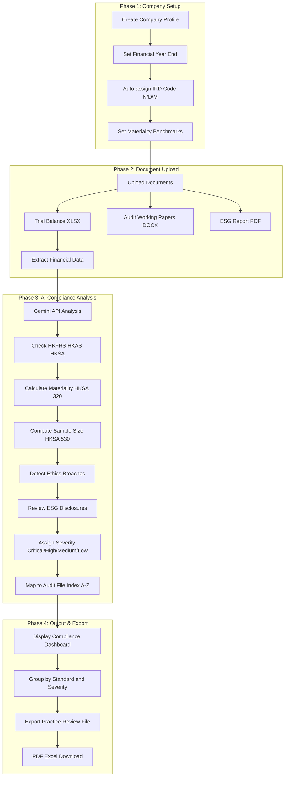

## ⭐ Finance & Audit Skills Strengthened
- **Dynamic Materiality Framework (HKSA 320; HKSAE 3000 Revised)** – Engineered an automated materiality engine that calculates Overall Materiality, Performance Materiality, and Clearly Trivial thresholds using user‑selected benchmarks (Profit Before Tax, Total Revenue, Total Assets, Net Assets or custom benchmarks). Applied professional judgment to drive risk triage and compliance prioritisation.
- **Audit Sampling Automation (HKSA 530; HKSAE 3000 Revised)** – Implemented audit sampling methodologies with sample size calculations driven by Performance Materiality, automatically flagging insufficient sample sizes in assurance engagements.
- **Quality Management System (HKSQM 1; HKSAE 3402)** – Designed support for all 8 components of firm‑level quality management, including Risk Assessment Process, Governance and Leadership, Relevant Ethical Requirements, Acceptance and Continuance, Engagement Performance, Resources, Information and Communication, Monitoring and Remediation Process.
- **Engagement Quality Review (HKSQM 2; HKSAE 3000 Revised)** – Built EQR assignment dashboards/workflows and comprehensive review checklists, ensuring compliance with quality management requirements for listed entity audits and assurance engagements.
- **Regulatory Inspection Readiness (HKSAE 3000; HKSAE 3402)** – Developed a one‑click export feature that packages the entire audit file in HKICPA Practice Review structure, with filtering by standard (e.g., HKSA 230, HKFRS 16) and full audit trail logging suitable for external auditor and regulator review.
- **Ethics & Independence Integration (HKSAE 3000; HKSAE 3402)** – Embedded HKICPA Code of Ethics checks into multi‑company workflows, including confidentiality breach detection, independence threat identification, and non‑audit service conflict flagging.
- **Multi‑Format Data Ingestion (HKSAE 3000; HKSAE 3410)** – Built parsers for structured data (ERP exports, SAP, Oracle, Excel trial balances) and unstructured data (working papers, ESG disclosures, sustainability reports), supporting assurance on both financial and non‑financial information.

## 🤖 Tech Stack
- **Language** – TypeScript, HTML
- **Framework** – React (with Vite)
- **UI** – Standard React components, styled via TSX
- **Runtime** – Node.js
- **AI** – Google Gemini (for anomaly detection and standard mapping)

## ⚙️ Run Locally

**Prerequisites:**  Node.js

1. Install dependencies:
   `npm install`
2. Set the `GEMINI_API_KEY` in [.env.local](.env.local) to your Gemini API key
3. Run the app:
   `npm run dev`

## 📋 Sample

### Purpose
This package provides structured test data to validate the application’s ability to detect anomalies and non‑compliance across Hong Kong accounting, auditing, quality management, ethics, assurance, ESG, and materiality‑driven audit sampling frameworks.

### Scope
The tests cover:
- Accounting (HKFRS 15, HKFRS 16)
- Audit (HKSA 230)
- Materiality calculation & risk triage (HKSA 320)
- Audit sampling size engine (HKSA 530)
- Quality Management (HKSQM 1, HKSQM 2)
- Assurance Engagements on Greenhouse Gas Statements (HKSAE 3410)
- Assurance & Related Services (HKSRS 4400)
- Ethics & Independence (HKICPA Code of Ethics)
- ESG / Sustainability Disclosures

### Companies Used
- ABC Corporation Limited (fictitious, for initial tests)
- China Metal Recycling (Holdings) Limited (real company name, fictitious financial data)

### Testing Results

#### 1. App Tabs Overview

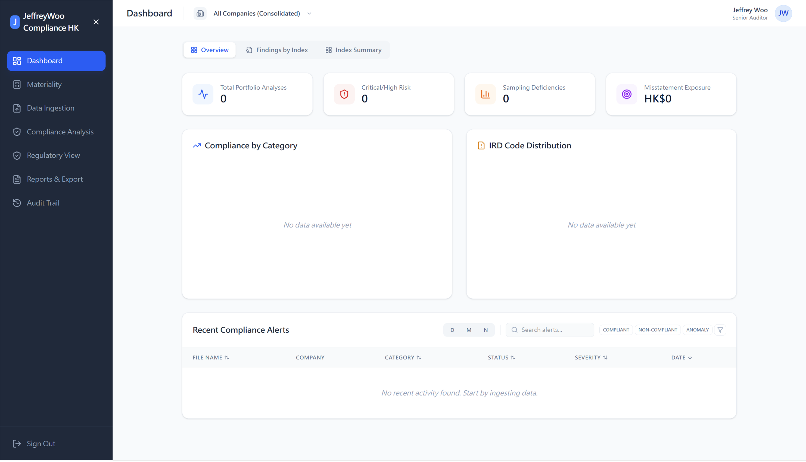
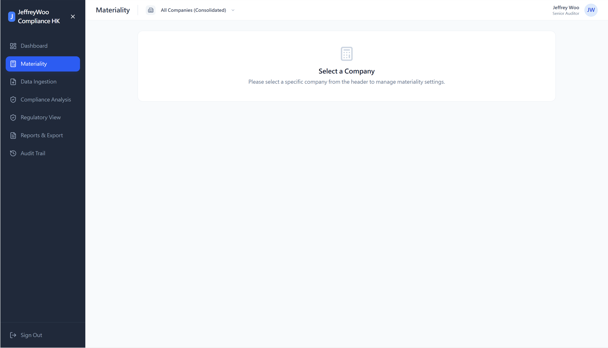

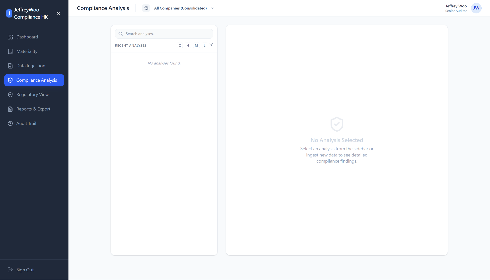
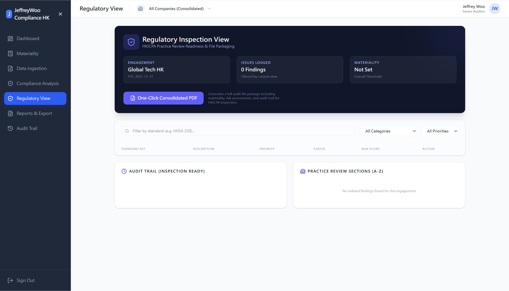
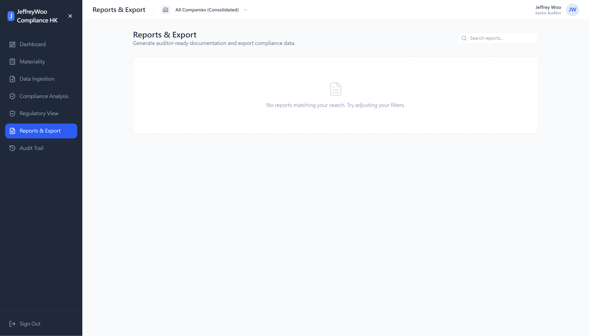
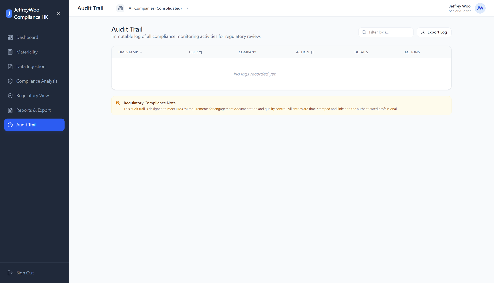

#### 2. Setup of New Company

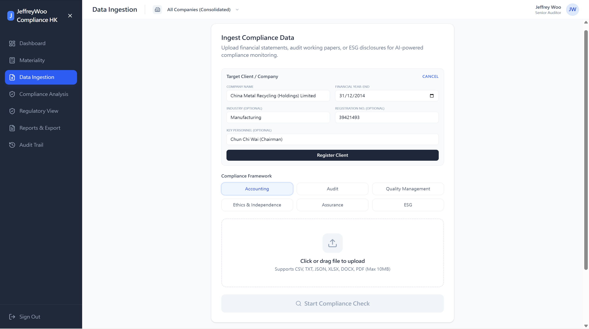

#### 3. Background Check Results for the Company and Its Management

#### 4. Testing Results for Accounting (Trial Balance.xlsx)

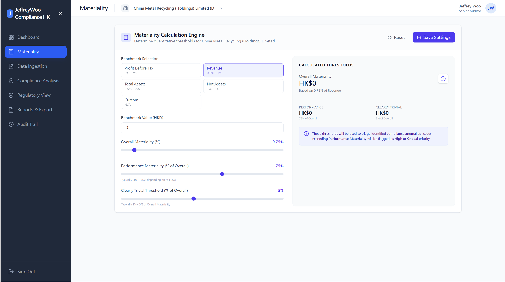

**Note:** Materiality can be set preliminarily before uploading the trial balance, and later updated automatically by fetching financial data from the uploaded trial balance/financial statement. The app then uses the final materiality values to check sample sizes and prioritise issues. This two‑step process allows flexibility for planning and accuracy for execution.

**Note:** After clicking the "Google Research" button, the app will display the Standard Research Details with hyperlinks to the source documents.

#### 5. Materiality Setup (benchmark value can be fetched from the uploaded trial balance or financial statements)

**Note:** The percentages used for calculating the materiality thresholds (e.g., 0.75% of Revenue for Overall Materiality, 75% of Overall Materiality for Performance Materiality, 5% of Overall Materiality for Clearly Trivial) can be adjusted by the user to suit the engagement’s risk profile and professional judgment.

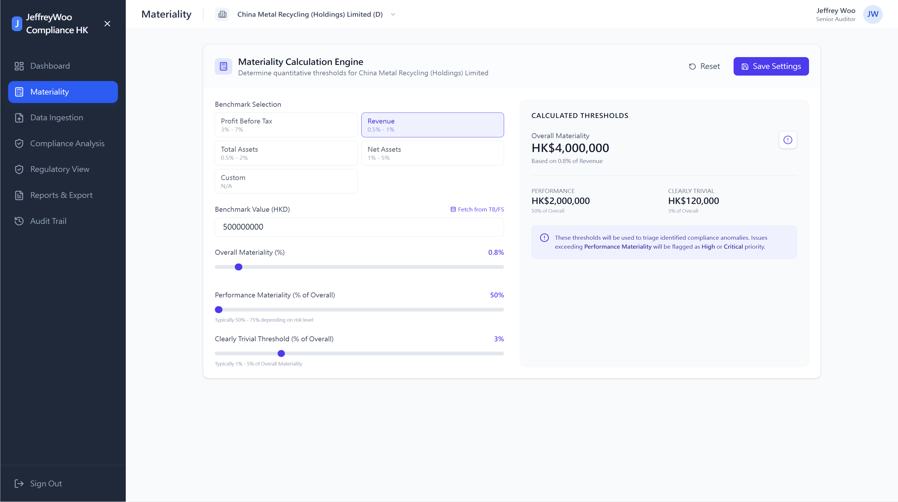

#### 6. Testing Results for Audit (Compliance Issues.docx)

#### 7. Testing Results for Quality Management (Audit Firm Annual Quality Risk Management Record.docx)

#### 8. Testing Results for Quality Management (Engagement Quality Review Checklist.docx)

#### 9. Testing Results for Quality Management (Audit Client Continuance Risk Assessment Form.docx)

#### 10. Testing Results for Quality Management (Audit Firm Annual Quality Monitoring Report.docx)

#### 11. Testing Results for Quality Management (Audit Firm Annual Partner Performance Review.docx)

#### 12. Testing Results for Ethics & Independence (Quality Control Review Notes.docx)

#### 13. Testing Results for Assurance (Audit Working Papers.docx)

#### 14. Testing Results for ESG (Sustainability Report.docx)

#### 15. Dashboard (Overview, Findings by Index, Index Summary)

**Note:** The severity and index assignments follow the HKICPA Audit Practice Manual.

#### 16. Regulatory View

#### 17. Reports & Export

#### 18. Audit Trail

#### Uploaded Documents of Test Cases

| Item	| Test Category	| Uploaded Document	| Document Content | 
|-------|---------------|-------------------|------------------|
| 1	| Accounting | [Trial Balance.xlsx](https://github.com/wcfjeffrey/jeffreywoo-compliance-hk-ai-model/blob/main/uploads/Trial%20Balance.xlsx) | Financial ledger balances	|
| 2	| Audit | [Compliance Issues.docx](https://github.com/wcfjeffrey/jeffreywoo-compliance-hk-ai-model/blob/main/uploads/Compliance%20Issues.docx) | Audit compliance findings |
| 3	| Quality Management | [Audit Firm Annual Quality Risk Management Record.docx](https://github.com/wcfjeffrey/jeffreywoo-compliance-hk-ai-model/blob/main/uploads/Audit%20Firm%20Annual%20Quality%20Risk%20Management%20Record.docx) | Firm-level quality risks |
| 4	| Quality Management | [Engagement Quality Review Checklist.docx](https://github.com/wcfjeffrey/jeffreywoo-compliance-hk-ai-model/blob/main/uploads/Engagement%20Quality%20Review%20Checklist.docx) | Engagement Quality Review (EQR) procedures |
| 5	| Quality Management | [Audit Client Continuance Risk Assessment Form.docx](https://github.com/wcfjeffrey/jeffreywoo-compliance-hk-ai-model/blob/main/uploads/Audit%20Client%20Continuance%20Risk%20Assessment%20Form.docx) | Client acceptance/retention evaluation |
| 6	| Quality Management | [Audit Firm Annual Quality Monitoring Report.docx](https://github.com/wcfjeffrey/jeffreywoo-compliance-hk-ai-model/blob/main/uploads/Audit%20Firm%20Annual%20Quality%20Monitoring%20Report.docx)	| Internal monitoring results |
| 7	| Quality Management | [Audit Firm Annual Partner Performance Review.docx](https://github.com/wcfjeffrey/jeffreywoo-compliance-hk-ai-model/blob/main/uploads/Audit%20Firm%20Annual%20Partner%20Performance%20Review.docx) | Partner appraisal |
| 8	| Ethics | [Quality Control Review Notes.docx](https://github.com/wcfjeffrey/jeffreywoo-compliance-hk-ai-model/blob/main/uploads/Quality%20Control%20Review%20Notes.docx) | Ethics / Quality Control (QC) review observations |
| 9	| Assurance | [Audit Working Papers.docx](https://github.com/wcfjeffrey/jeffreywoo-compliance-hk-ai-model/blob/main/uploads/Audit%20Working%20Papers.docx) | Evidence from specific engagements |
| 10	| ESG | [Sustainability Report.docx](https://github.com/wcfjeffrey/jeffreywoo-compliance-hk-ai-model/blob/main/uploads/Sustainability%20Report.docx) | ESG disclosures and metrics |

**Note:**

(1) Trial Balance.xlsx in this test package contains additional audit samples (e.g., sampling method, sample size tested) to facilitate testing of the HKSA 530 audit sampling engine.

(2) For testing the compliance monitoring features, you can upload either:
- **Trial Balance** – Recommended for testing materiality calculations, audit sampling, and detailed account‑level assertions
- **Financial Statements** – Including income statement, balance sheet, cash flow statement, and notes to the accounts

The app will automatically extract relevant financial data from both formats to perform compliance checks against HKFRS, HKAS, HKSA, and other frameworks.

*Tip: For the most comprehensive testing (especially materiality‑driven sample size calculations and assertion‑based evidence tracking), the Trial Balance format provides richer account‑level detail; whereas Financial Statements are suitable for higher‑level disclosure and presentation checks.*

## 🔒 Local Deployment Option (Planned / Configurable)

This application is designed to support local deployment for organisations that require complete control over sensitive financial and audit data.

While the current version includes optional cloud‑based AI features (e.g., Gemini API), the architecture allows for:
- ✅ Local installation on your own servers or workstations
- ✅ Offline operation by replacing cloud APIs with local rule‑based engines
- ✅ Full data privacy – no client data sent to external services

**Current status:** Local deployment is a supported configuration. For organisations with strict data residency or confidentiality requirements, please contact me for setup guidance.

## Source References

**JeffreyWoo Compliance HK** references the following Hong Kong accounting, auditing, and ethical standards. Below are the official sources and citation information:

**1. Official Standards & Frameworks**

**Hong Kong Financial Reporting Standards (HKFRS) & Hong Kong Accounting Standards (HKAS)**

- [Hong Kong Institute of Certified Public Accountants. (2025). Hong Kong Financial Reporting Standards.](https://www.hkicpa.org.hk/en/Standards-setting/Standards/Members-Handbook-and-Due-Process/Due-Process/Financial-reporting)

**Hong Kong Standards on Auditing (HKSA)**

- [Hong Kong Institute of Certified Public Accountants. (2025). Hong Kong Auditing and Assurance Standards.](https://www.hkicpa.org.hk/en/Standards-setting/Standards/Members-Handbook-and-Due-Process/Due-Process/Auditing-Assurance)
- [Hong Kong Institute of Certified Public Accountants (HKICPA). HKSA 230 (Audit Documentation).](https://www.hkicpa.org.hk/-/media/HKICPA-Website/Members-Handbook/volumeIII/3094hksa230.pdf#page=1)
- [Hong Kong Institute of Certified Public Accountants (HKICPA). HKSA 320 (Materiality in Planning and Performing an Audit).](https://www.hkicpa.org.hk/-/media/HKICPA-Website/Members-Handbook/volumeIII/30910sa320.pdf#page=1)
- [Hong Kong Institute of Certified Public Accountants (HKICPA). HKSA 500 (Audit Evidence).](https://www.hkicpa.org.hk/-/media/HKICPA-Website/Members-Handbook/volumeIII/hksa500cfd.pdf#page=1)
- [Hong Kong Institute of Certified Public Accountants (HKICPA). HKSA 530 (Audit Sampling).](https://www.hkicpa.org.hk/-/media/HKICPA-Website/New-HKICPA/Standards-and-regulation/SSD/03_Our-views/Stdspn/ref/arhb296/hksa530cfd.pdf#page=1)
- [Hong Kong Institute of Certified Public Accountants (HKICPA). HKSA 550 (Related Parties).](https://www.hkicpa.org.hk/-/media/HKICPA-Website/Members-Handbook/volumeIII/30914sa550.pdf#page=1)
- [Hong Kong Institute of Certified Public Accountants (HKICPA). HKSA 570 (Going Concern).](https://www.hkicpa.org.hk/-/media/HKICPA-Website/Members-Handbook/volumeIII/30915sa570.pdf#page=1)

**Hong Kong Standards on Quality Management (HKSQM)**

- [Hong Kong Institute of Certified Public Accountants (HKICPA). HKSQM 1 (Quality Management for Firms)](https://www.hkicpa.org.hk/-/media/HKICPA-Website/Members-Handbook/volumeIII/hksqm1.pdf)
- [Hong Kong Institute of Certified Public Accountants (HKICPA). HKSQM 2 (Engagement Quality Reviews)](https://www.hkicpa.org.hk/-/media/HKICPA-Website/Members-Handbook/volumeIII/hksqm2.pdf)

**HKICPA Code of Ethics**

- [Hong Kong Institute of Certified Public Accountants. (2018). Code of ethics for professional accountants (Revised ed.).](https://www.hkicpa.org.hk/en/Standards-setting/Standards/New-and-major-standards/New-and-Major-Standards/New-code-of-ethics)

**Hong Kong Standards on Assurance Engagements (HKSAE)**

  - [Hong Kong Institute of Certified Public Accountants (HKICPA). HKSAE 3000 (Assurance Engagements Other Than Audits or Reviews)](https://www.hkicpa.org.hk/-/media/HKICPA-Website/Members-Handbook/volumeIII/hksae3000rev.pdf)
  - [Hong Kong Institute of Certified Public Accountants (HKICPA). HKSAE 3402 (Assurance Reports on Controls)](https://www.hkicpa.org.hk/-/media/HKICPA-Website/Members-Handbook/volumeIII/hksae3402.pdf)
  - [Hong Kong Institute of Certified Public Accountants (HKICPA). HKSAE 3410 (Assurance on Greenhouse Gas Statements)](https://www.hkicpa.org.hk/-/media/HKICPA-Website/Members-Handbook/volumeIII/hksae3410.pdf)

**Hong Kong Standards on Related Services (HKSRS)**

- [Hong Kong Institute of Certified Public Accountants (HKICPA). HKSRS 4400 (Agreed-Upon Procedures Engagements).](https://www.hkicpa.org.hk/-/media/HKICPA-Website/Members-Handbook/volumeIII/hksrs4400.pdf#page=1)

**2. ESG & Sustainability Disclosure Guidance**

**HKICPA Sustainability Guidance**

- [Hong Kong Institute of Certified Public Accountants (HKICPA). Auditing and Assurance Technical Bulletin (AATB) 5: Environmental, Social and Governance (ESG) Assurance Reporting](https://aplus.hkicpa.org.hk)

**ISSB-Aligned Disclosure Standards (HKFRS S1 & S2)**

- [Hong Kong Institute of Certified Public Accountants. (2024). *HKFRS S1 General Requirements for
Disclosure of Sustainabilityrelated Financial Information*.](https://www.hkicpa.org.hk/-/media/HKICPA-Website/Members-Handbook/volumeIV/319s1.pdf)
- [Hong Kong Institute of Certified Public Accountants. (2024). *HKFRS S2 Climate-related Disclosures*.](https://www.hkicpa.org.hk/-/media/HKICPA-Website/Members-Handbook/volumeIV/319s2.pdf#page=1)

**3. Regulatory & Filing Guidance**

**Inland Revenue Department (IRD) - Accounting Date Codes**

- [Inland Revenue Department. (2025). Profits tax returns filing guidelines. Hong Kong SAR Government.](https://www.ird.gov.hk)

**HKICPA Practice Review Framework**

- [Hong Kong Institute of Certified Public Accountants. (2025). Practice review manual.](https://www.hkicpa.org.hk/en/Practice-Review)

**HKICPA Audit File Index (A-Z)**

- [Hong Kong Institute of Certified Public Accountants (HKICPA). Practice Review Manual - Audit Documentation Guidelines.](https://www.hkicpa.org.hk/en/Practice-Review/Practice-Review-Manual)

**4. Professional Guidance & Commentaries**

**Quality Management Implementation**

- [Lo, C. (2021, March). A new approach to quality management. A Plus.](https://aplus.hkicpa.org.hk)

**Code of Ethics Revisions**

- [Chan, S. (2019, November). Revised Code of Ethics: Key areas of focus for auditors. A Plus.](https://aplus.hkicpa.org.hk)

**Technical Updates**

- [Hong Kong Institute of Certified Public Accountants. (2025, January 7). Handbook update No. 320. Technical News.](https://www.hkicpa.org.hk)

**5. Regulatory Enforcement**

**Accounting and Financial Reporting Council (AFRC)**

- [Accounting and Financial Reporting Council. (n.d.). Completed enquiry and investigations.](https://www.afrc.org.hk)

**Dictionary & Terminology**

- [Law Insider. (2025). HKFRS 16 definition.](https://www.lawinsider.com/dictionary/hkfrs-16)

## ⚖️ Disclaimer

**Testing Sample:**

The financial data, trial balance figures, compliance issues, audit working papers, and all quantitative information presented in this sample are fictitious and created solely for testing and demonstration purposes. They do not represent the actual financial position, performance, or audit findings of China Metal Recycling (Holdings) Limited or any of its director.

However, the company name China Metal Recycling (Holdings) Limited and its chairman name Mr Chun Chi Wai are real, and refer to the actual legal entity and person associated with the historical case for testing Background Check by this app. Any resemblance of the fictitious financial data to actual events or figures is purely coincidental.

This sample is intended exclusively for software testing, academic, or professional development use and should not be relied upon for any investment, legal, or regulatory decision. References to all accounting and audit standards are for identification only.

**This App:**

This app is for **informational and demonstration purposes only**. It does not constitute professional accounting, auditing, or legal advice. Always consult a qualified professional before making compliance decisions.

The app is provided “as is” without warranties of accuracy or fitness for a particular purpose. Outputs are based on pre‑defined rules and AI models; professional judgment remains essential.

To the fullest extent permitted by law, the developer of this app is not liable for any damages arising from use of this app.

## 📄 License

**GNU Affero General Public License v3.0 (AGPL‑3.0)** — JeffreyWoo HK Compliance

- ✅ You are free to use, modify, and distribute this software, provided that any derivative works are also licensed under AGPL‑3.0.
- ✅ If you run or deploy this software over a network (e.g., as a web service), you must make the source code of your modified version available to all users who interact with it.
- ✅ This ensures transparency, collaboration, and continued open‑source availability of improvements.
- ❌ The software is provided “as is”, without warranties of any kind.

For full details, see the [LICENSE](./LICENSE) file.

## 👤 About the Author
Jeffrey Woo — Finance Manager | Strategic FP&A, AI Automation & Cost Optimization | MBA | FCCA | CTA | FTIHK | SAP Financial Accounting (FI) Certified Application Associate | Xero Advisor Certified

📧 Email: jeffreywoocf@gmail.com  
💼 LinkedIn: https://www.linkedin.com/in/wcfjeffrey/  
🐙 GitHub: https://github.com/wcfjeffrey/
